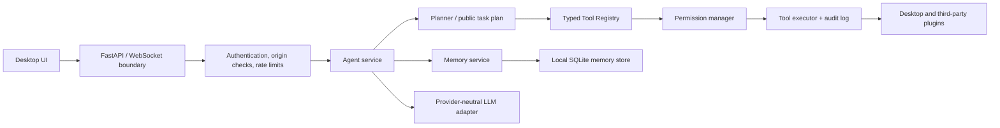

# ARIA Architecture

## Non-negotiable boundaries

- No model output is ever passed to a shell or terminal.
- Every side effect is a typed plugin tool with Pydantic validation and an explicit permission level.
- The API layer owns authentication, origin validation, rate limiting, and structured errors.
- Application services depend on the `LLMProvider` interface, not Ollama or any HTTP client.
- Memory is local, category-specific, timestamped, scored, deduplicated, and individually deletable.
- Task plans expose actionable progress and tool activity, never private chain-of-thought.

## Extension points

Third-party capability packages register an `aria.plugins` Python entry point. Providers implement the `LLMProvider` contract. New persistence implementations sit behind memory repositories; they must preserve user-owned deletion and metadata semantics.
